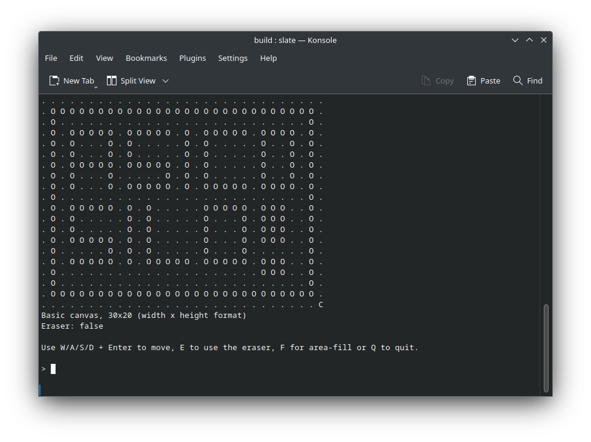
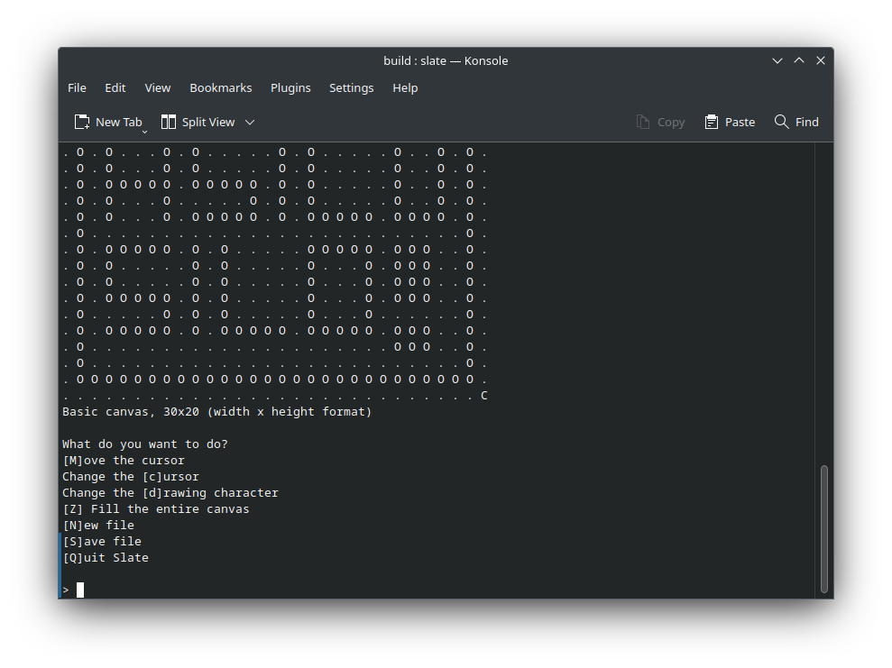
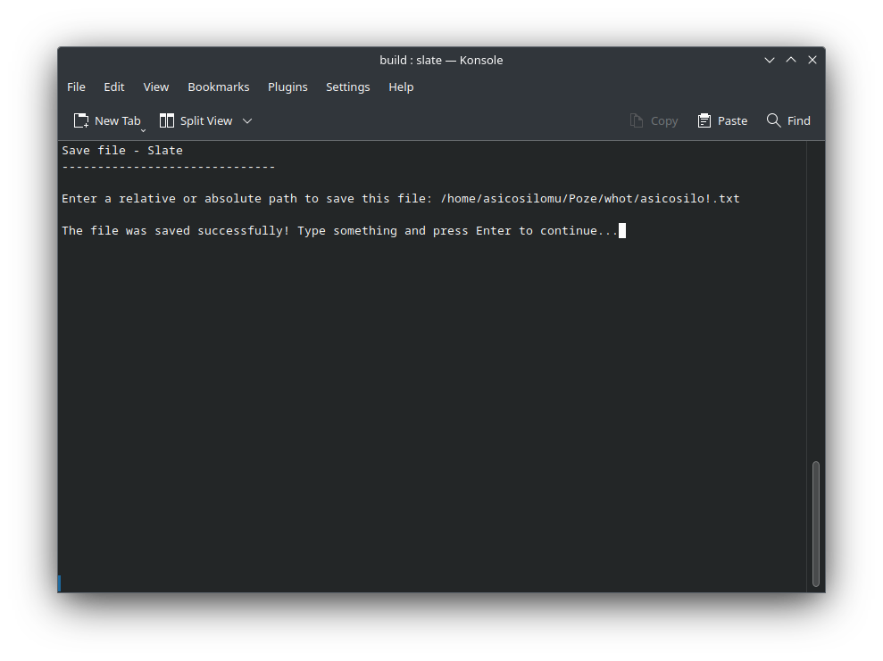
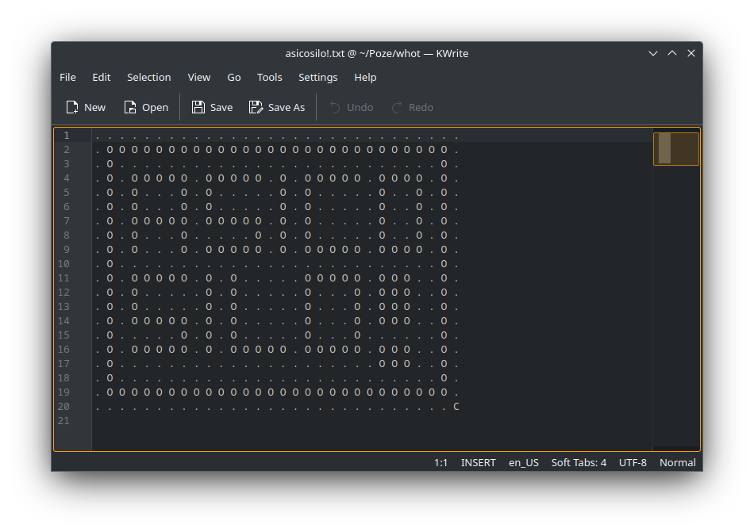

# slate
A basic ASCII drawing program written in C++. Draw something then export it to a text file. romanian support!1!!11!1!!!!!!1!11!111!!!!!!!

# w- where iz binary??????
Nowhere. Compile it yourself you lazy bastard.

# Screenshots

